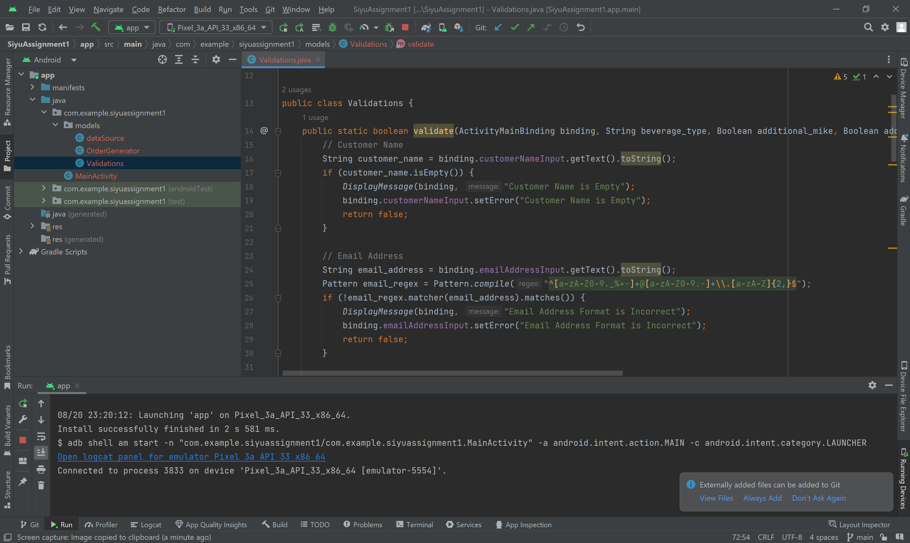
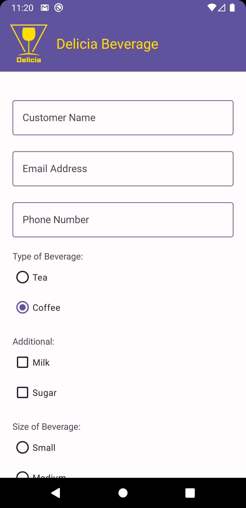
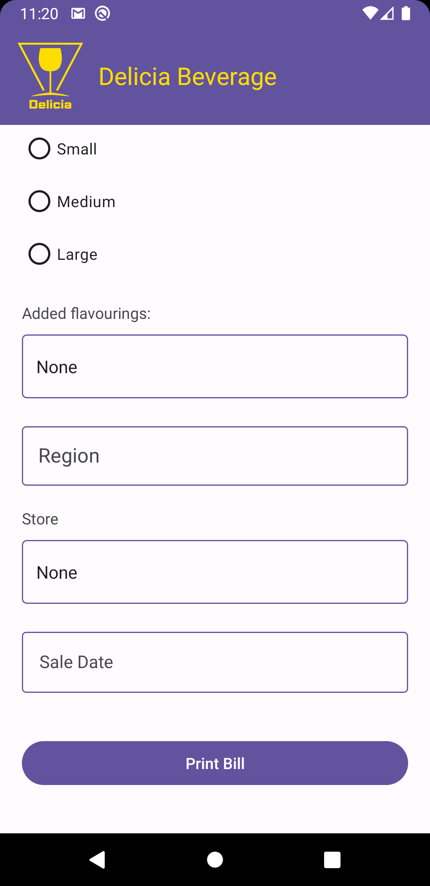
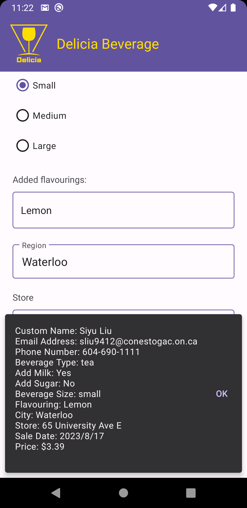

# PROG8485-Android-Assignment1-Delicia-Beverage-Form

The assignment 1 of PROG8485 Mobile Application development, is creating an order form SPA for a retail store named "Delicia Beverage". The content of this project consists of EditText, Radio Group, AutoCompleteTextView etc. When tapping the submit button，if the inputed data is valid, it will display a toast message to display the info.

## Validation

Pass the activity's binding object as the the param of the validation.

## Preview

